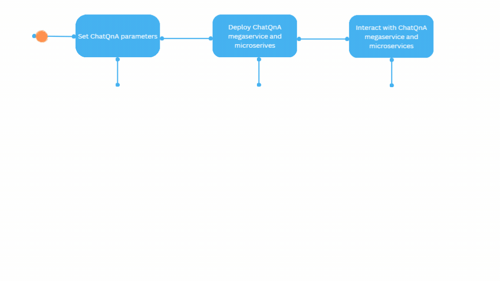

# Початок роботи з OPEA

## Передумови

Щоб розпочати роботу з OPEA, вам потрібне відповідне обладнання і базове налаштування програмного забезпечення.

Вимоги до обладнання: Якщо вам потрібен доступ до апаратного забезпечення, відвідайте хмару для розробників Intel Tiber, щоб вибрати серед варіантів, таких як процесори Xeon або Gaudi, які відповідають необхідним специфікаціям.

Вимоги до програмного забезпечення: Будь ласка, зверніться до матриці підтримки [*Потрібне гіперпосилання*], щоб переконатися, що у вас є необхідні програмні компоненти.

## Розуміння основних компонентів OPEA

Перш ніж рухатися далі, важливо ознайомитися з двома ключовими елементами OPEA: GenAIComps і GenAIExamples.
1.	GenAIComps: GenAIComps - це набір мікросервісних компонентів, які формують сервісний інструментарій. Сюди входять різноманітні сервіси, такі як llm (моделі вивчення мови), вбудовування і переранжування, серед інших.
2.	GenAIExamples: У той час як GenAIComps пропонує ряд мікросервісів, GenAIExamples надає практичні, розгортаємі рішення, які допомагають користувачам ефективно впроваджувати ці сервіси. Приклади включають ChatQnA і DocSum, які використовують мікросервіси для конкретних додатків. 

## Візуальний посібник з розгортання
Для ілюстрації, ось спрощений візуальний посібник з розгортання ChatQnA GenAIExample, який демонструє, як ви можете налаштувати це рішення всього за кілька кроків. 



## Налаштування параметрів ChatQnA
Щоб розгорнути служби ChatQnA, виконайте ці кроки:

```
git clone https://github.com/opea-project/GenAIExamples.git
cd GenAIExamples/ChatQnA
```

### Встановіть потрібні змінні середовища:
```
# Example: host_ip="192.168.1.1"
export host_ip="External_Public_IP"
# Example: no_proxy="localhost, 127.0.0.1, 192.168.1.1"
export no_proxy="Your_No_Proxy"
export HUGGINGFACEHUB_API_TOKEN="Your_Huggingface_API_Token"
```

Якщо ви використовуєте проксі-сервер, також встановіть змінні середовища, пов'язані з проксі-сервером:
```
export http_proxy="Your_HTTP_Proxy"
export https_proxy="Your_HTTPs_Proxy"
```

Налаштуйте інші змінні середовища для конкретного випадку використання, вибравши одну з цих опцій відповідно до вашого обладнання:

```
# on Xeon
source ./docker_compose/intel/cpu/xeon/set_env.sh
# on Gaudi
source ./docker_compose/intel/hpu/gaudi/set_env.sh
# on Nvidia GPU
source ./docker_compose/nvidia/gpu/set_env.sh
```

### Розгортання мегасервісу та мікросервісів ChatQnA
Виберіть файл compose.yaml, який відповідає вашому обладнанню.
```
#xeon
cd docker_compose/intel/cpu/xeon/
#gaudi
cd docker_compose/intel/hpu/gaudi/
#nvidia
cd docker_compose/nvidia/gpu/
```
Тепер ми можемо запустити сервіси
```
docker compose up -d
```
Він автоматично завантажить докер-образ на docker hub:
- docker pull opea/chatqna:latest
- docker pull opea/chatqna-ui:latest

У наступних випадках вам потрібно буде зібрати докер-образ з вихідного коду самостійно.

1. Failed to download the docker image.
2. Use the latest or special version.

Будь ласка, зверніться до розділу ['Збірка образів докерів'](/examples/ChatQnA/deploy) з файлу, який відповідає вашому апаратному забезпеченню.

### Взаємодія з мегасервісом і мікросервісом ChatQnA
Перш ніж взаємодіяти зі службою ChatQnA, переконайтеся, що служба TGI готова (її запуск займає до 2 хвилин).
```
docker ps
# expected: all images's status are up
# TGI example on on Xeon and Nvidia GPU
docker logs tgi-service | grep Connected
# TGI example on on Gaudi
docker logs tgi-gaudi-service | grep Connected
# execpted output: ... INFO text_generation_router::server: router/src/server.rs:2311: Connected
```
```
curl http://${host_ip}:8888/v1/chatqna \
    -H "Content-Type: application/json" \
    -d '{
        "messages": "What is the revenue of Nike in 2023?"
    }'
```
Ця команда надасть відповідь у вигляді текстового потоку. Ви можете змінити параметр повідомлення у команді curl і взаємодіяти зі службою ChatQnA.

### Що далі:

1. Спробуйте  [GenAIExamples](/examples/index.rst) детально, починаючи з [ChatQnA](/examples/ChatQnA/ChatQnA_Guide.rst) прикладу.
 
2. Спробуйте [GenAIComps](/microservices/index.rst) для побудови мікросервісів.
 
3. Зацікавлені у внеску в OPEA? Зверніться до [OPEA Community](/community/index.rst) і [Contribution Guides](/community/index.rst#contributing-guides).
 

